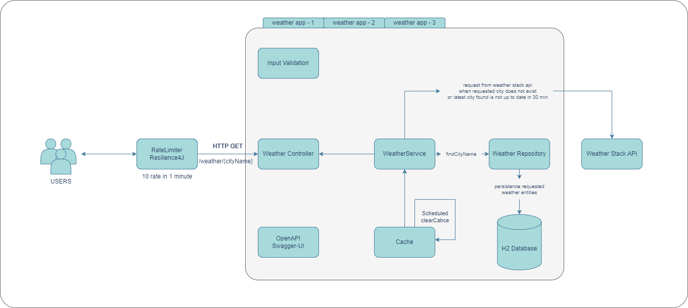

# Weather Service Application

## General Info:


---
* The Weather API allows users to search for the current weather report of a city by its name. The request is made to `/weather/{city}` URL with `{city}` as the path variable. 
* The city parameter is validated to ensure it is not blank or a decimal value. 
If it is invalid, a `400 - Http Bad Request` response is returned.
* The API gets the current weather from either the database or consumes the WeatherStack API using an API key. 
  * If the latest data is not older than 30 minutes, it is retrieved from the database. 
  * If the data is older than 30 minutes or does not exist in the database, a request is made to the WeatherStack API, and the result is cached. If there is a cached value with the city filter as the key, the response is returned from the cache directly.
* If there is too many request for api in 10 sec, a `429 Too Many Request` response is returned.
* For usages, weather Stack Api_Key should be defined in the `application.yml` file or an `.env` file .

* The API endpoint can be found on the Swagger page at` http://localhost:8080/swagger-ui/index.html`.


## Technology

---
- Java 17
- Spring Boot 3.0
- H2 In Memory Database
- Spring Data JPA
- Spring Cache
- Lombok
- Restful API
- Maven
- Docker, Docker Compose
- Prometheus, Grafana
- Open API Documentation
- IntelliJ IDEA

## Prerequisites

----
- Maven or Docker

## Docker Run

----
This application can be built and run using Docker. 
The Dockerfile has a multistage build, so building and running can be done in one step.

```sh
$ cd weatherapp
$ docker-compose up -d
```

Docker compose creates 3 replicas (instances) of the application on port range 9595-9597


### For open-api-ui:  `http://localhost:{9595-9597}/swagger-ui.html`
### For Prometheus: `http://localhost:9090`
### For Grafana: `http://localhost:3000`
USER, PASSWORD=admin


## Maven Run

---
To build and run the app with `Maven`:

```sh
$ cd weatherapp
$ mvn clean install
$ mvn spring-boot:run
```

---
